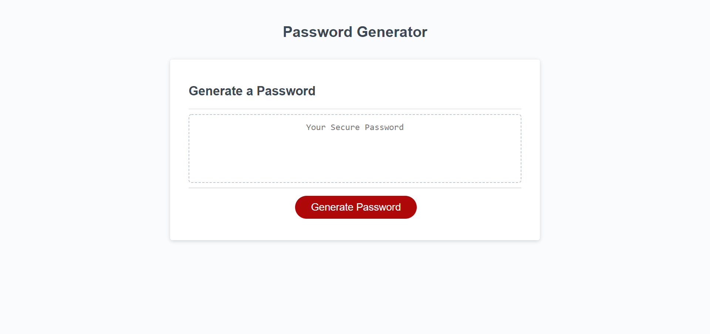

# Password Generator
A password generator built in javascript

## Description

This weeks project was a password generator built in javascript. It asks the user a series of questions about the types of characters that they want and then generates a unique password.

## Technologies Used

-HTML
-CSS
-Javascript

## Installation

1. Clone this repository to your computer's desktop.
2. Navigate to the top level directory.
3. Open the index.html file in a browser.

## Usage

## Link to Deployed Application and Repo

https://holgateb.github.io/password-generator/

https://github.com/holgateb